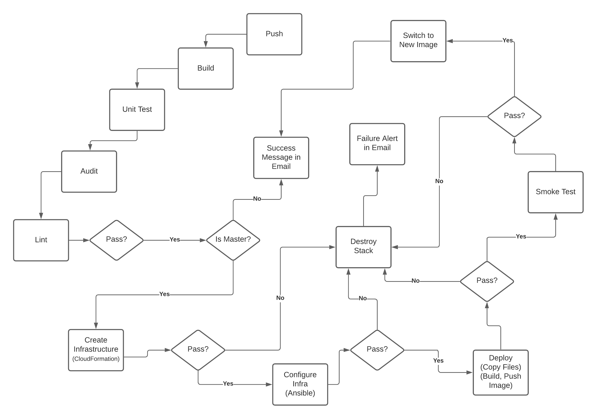
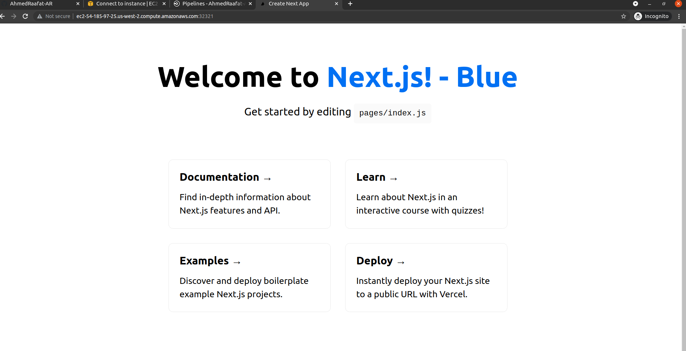
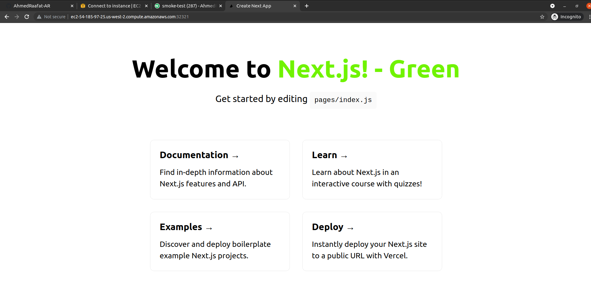

## Capstone Nextjs blog - Build CI/CD Pipelines, Blue/Green depolyment

## Pipeline

## Blue/Green

### Built With

- [Nextjs](https://nextjs.org/) - The React Framework for Production
- [Circle CI](www.circleci.com) - Cloud-based CI/CD service
- [Amazon AWS](https://aws.amazon.com/) - Cloud services
- [AWS CLI](https://aws.amazon.com/cli/) - Command-line tool for AWS
- [CloudFormation](https://aws.amazon.com/cloudformation/) - Infrastrcuture as code
- [Ansible](https://www.ansible.com/) - Configuration management tool
- [kubernetes](https://kubernetes.io/) - Production-Grade Container Orchestration
- [Minikube](https://minikube.sigs.k8s.io/) - Minikube is local Kubernetes

### License

[License](LICENSE.md)
